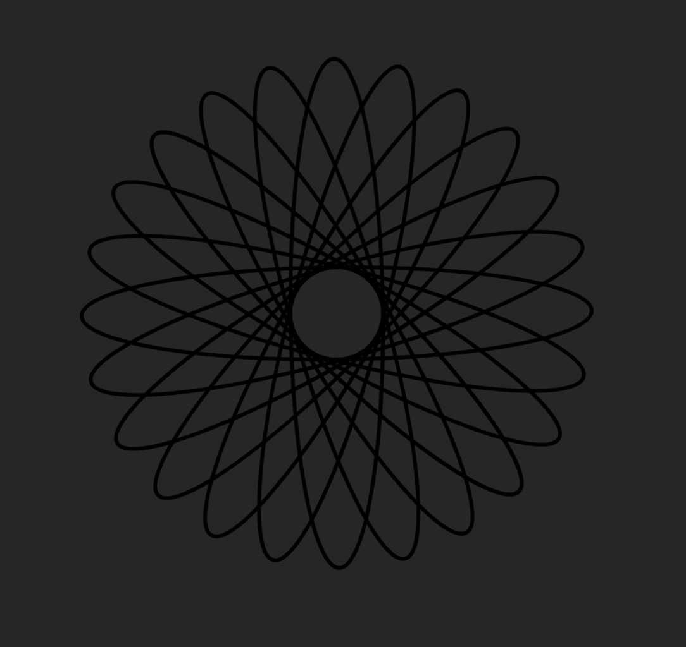

# Day 03  

## Covering other features of GIT  
__git status__  
__git log__  
__git pull__  

## Covering more features of VIM  
__v__  
__y__  

## Making a rotating animation  

source for animation at [On-Hover Spinner Animation](https://www.youtube.com/watch?v=eT2G5zV_JTA)  

+ Making the index.html  
+ Making the stylesheet  
+ Linking the stylesheet  
+ keyframes in CSS  
+ Adding -webkit for browser compatibility  

# End product  
  

# Pushing it to GitHub  
